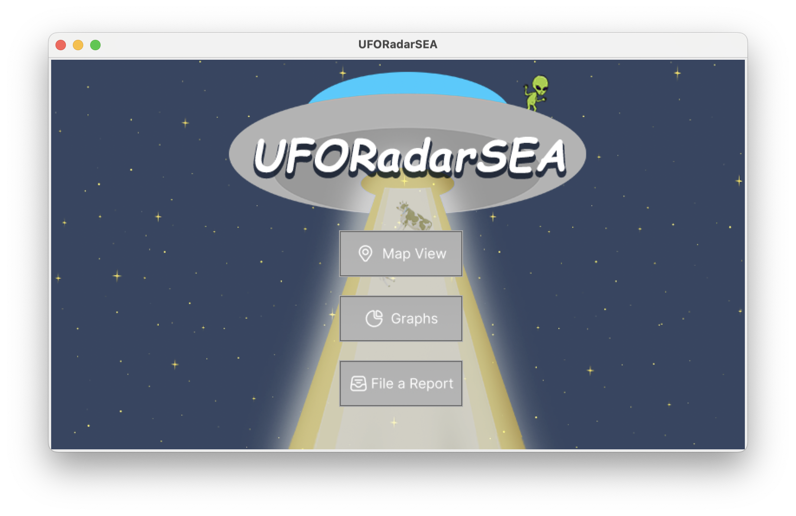
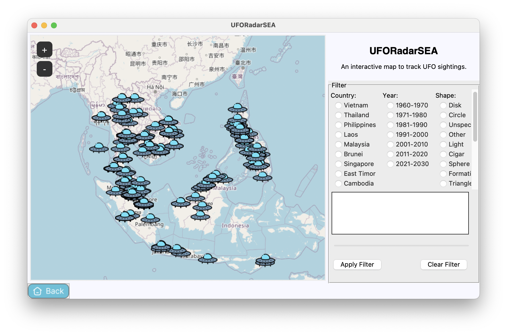
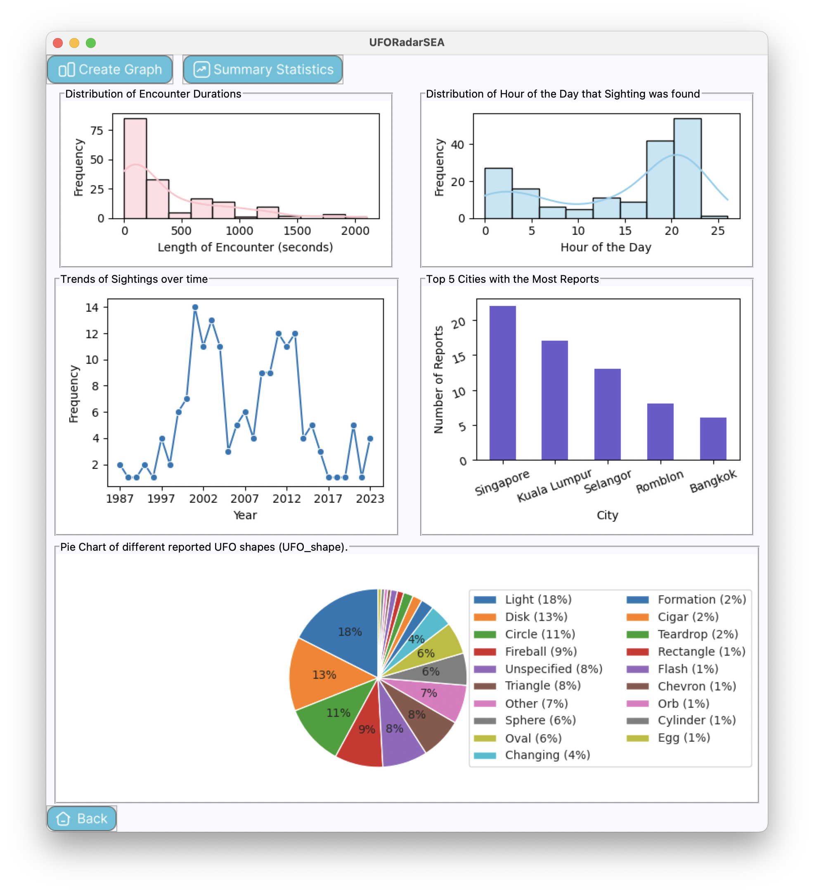
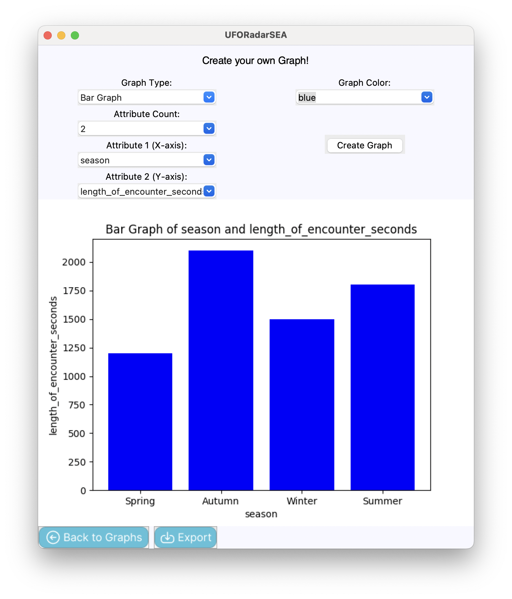
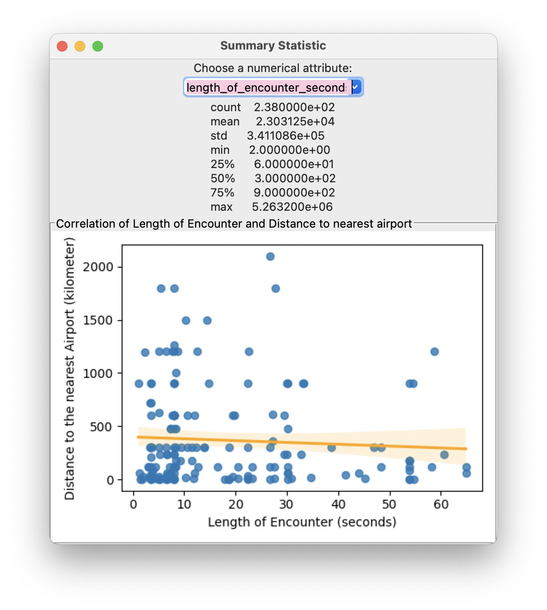
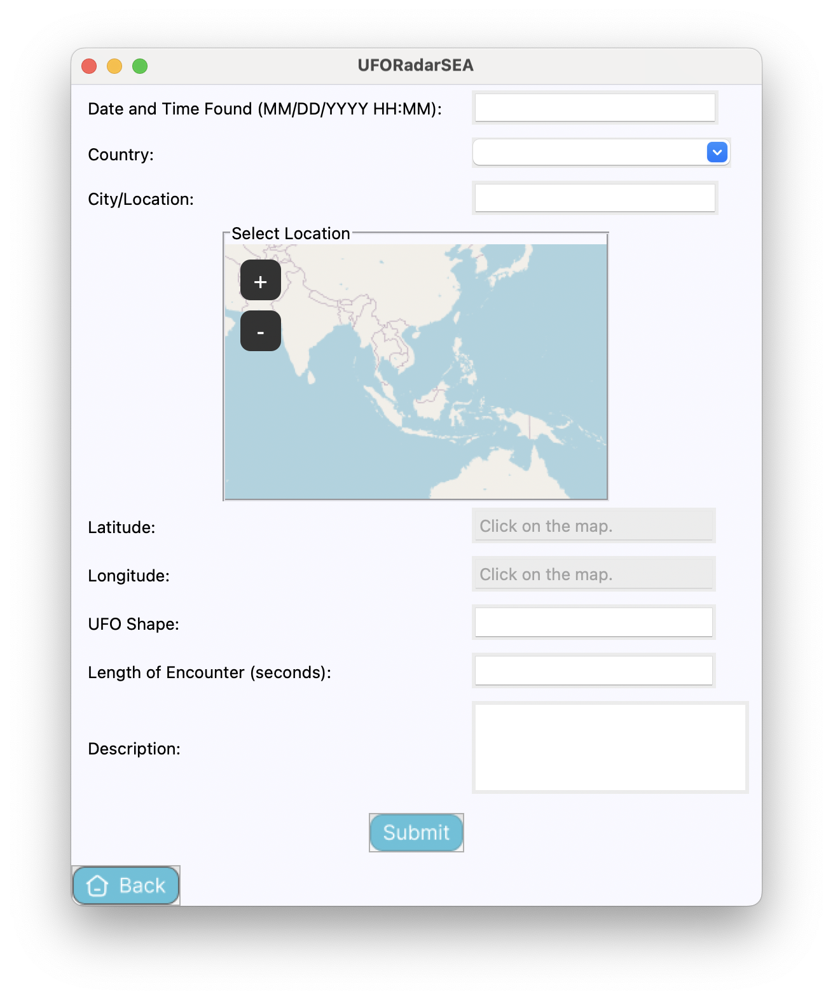

# UFORadarSEA

## Description
The UFORadarSEA is a desktop GUI application built using Python's Tkinter library. It allows users to explore UFO sighting data, create custom graphs based on various attributes, and submit new UFO sighting reports.

## Main Features
- View UFO sighting reports on a map. (View Map Page)
- Filter reports based on various criteria. (View Map Page)
- Create custom graphs based on user-selected attributes. (Graphs Page)
- Summary statistics of UFO sightings data, such as counts, mean, median, standard deviation, minimum, and maximum values for different attributes. (Graphs Page)
- Users can file a report of a UFO sighting. (File a Report Page)

## Screenshots
|          | **Home Page**               |
|:----------------------------------------------------------------------------|:----------------------------|
|      | **Map Page**                |
|        | **Graphs Page**             |
|  | **Create Graph Page**       |
|          | **Summary Statistics Page** |
|        | **Report Page**             |

## Installation
1. Clone this repository to your local machine:
   ```bash
   git clone https://github.com/pannlnwza/UFORadarSEA.git
    ```
2. Navigate to the project directory
   ```bash
   cd UFORadarSEA
    ```

## How To Run
To run the application, follow these steps:

```shell
python -m venv env
```
Activate the virtual environment using one of the following commands, depending on your operating system:

- **Windows:**

    ```bash
    .env\Scripts\activate
    ```

- **macOS/Linux:**

    ```bash
    source env/bin/activate
    ```
Once the virtual environment is activated, install the required packages using pip:
```bash
pip install -r requirements.txt
python main.py
```

## Project Documents
- [Project Proposal](wiki/Project-Proposal.md)
- [Development Plan](wiki/Development-Plan.md)
- [UML Diagrams](wiki/UML-Diagrams.md)

## Data Sources
The UFO Radar Application uses UFO sighting data sourced from [NUFORC](https://www.nuforc.org/) (National UFO Reporting Center) and The Global Airport Database (GADB) data by [Arash Partow](https://www.partow.net/miscellaneous/airportdatabase/).
